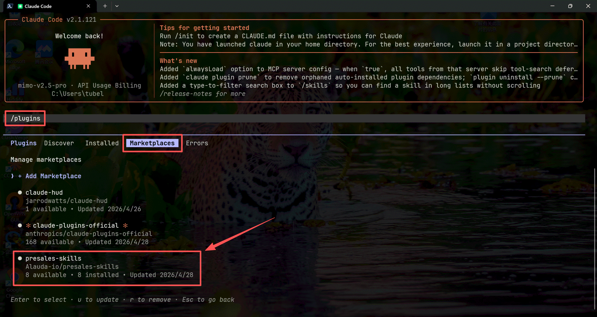
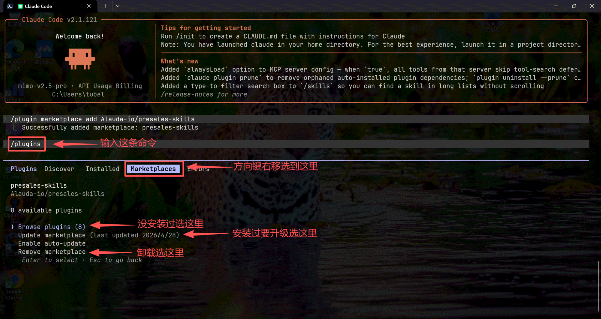
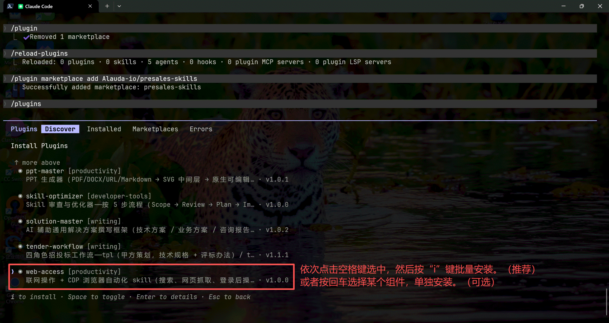
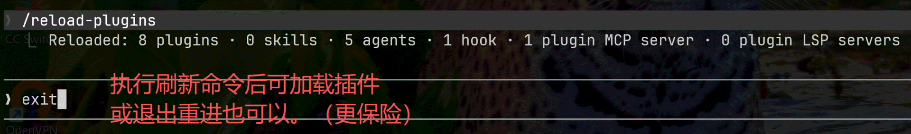
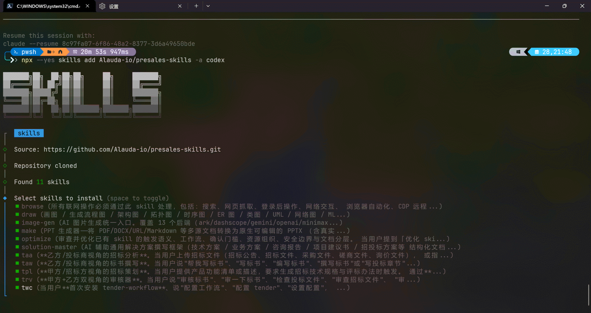

# presales-skills — 售前工作 skill 集合

面向售前 / 解决方案 / 咨询场景的 SKILL 集合，统一通过 marketplace 分发。

**目标用户**：做售前 / 写方案 / 招投标 / 做 PPT 的人，希望帮助大家少掉头发，多产输出；少熬夜加班，多陪陪自己和家人。

**兼容性**：同时支持 **Claude Code**（marketplace 直装）和 **Cursor / Codex / OpenCode**（[vercel-labs/skills](https://github.com/vercel-labs/skills) CLI 装）。

---

## 8 个 plugin 一览

按角色拆分：4 个**共享 plugin** 提供底层能力（被主 plugin 调用，也可独立使用），3 个**主 plugin** 串成端到端业务流程，1 个**开发者工具 plugin** 用于审查和优化 skill 自身。

### 共享 plugin（底层能力 / 4 个）

| plugin | 入口 | 一句话 |
|---|---|---|
| **ai-image** | `/ai-image:gen` 或 `/image-gen` | 统一 AI 生图引擎——13 个后端（volcengine/ark、qwen/dashscope、gemini、openai、minimax、stability、bfl、ideogram、zhipu、siliconflow、fal、replicate、openrouter）共享一份模型注册表与配置；自带 79 个结构化提示词模板（PPT slide / 信息图 / UI mockup / 学术图 / 技术图 / 海报 等 17 类）；OpenAI 后端额外支持图像编辑（inpainting）+ 透明背景 + webp/jpeg 输出。被 solution-master / ppt-master / tender-workflow 共同依赖 |
| **web-access** | `/web-access:browse` 或 `/browse` | 联网操作 + CDP 浏览器自动化（搜索 / 抓取 / 登录态 / 浏览器自动化），并提供 `mcp_installer.py` 把 tavily / exa / minimax 等搜索类 MCP server 一键注册到 `~/.claude.json`，且支持 `list-search-tools` 子命令实时枚举当前会话所有可用搜索 MCP（让 sm/tw setup 动态选默认） |
| **drawio** | `/drawio:draw` 或 `/draw` | Draw.io 图表（`.drawio` XML + 可选 PNG/SVG/PDF 导出），覆盖架构图 / 流程图 / 时序图 / ER 图 / 拓扑图 / ML 模型图等 |
| **anythingllm-mcp** | （MCP server，无 slash） | AnythingLLM 知识库语义搜索——装上自动注册 `anythingllm` MCP server，主 plugin 通过 `mcp__anythingllm__*` 工具直接调用 |

### 主 plugin（端到端业务流程 / 3 个）

| plugin | 入口 | 一句话 |
|---|---|---|
| **solution-master** | `/solution-master:go` 或 `/solution-master` | 通用解决方案撰写：苏格拉底式提问 → 任务分解 → 子智能体并行撰写 → 双阶段审查（spec + quality）→ 多源知识检索 → 配图 → Markdown + DOCX 输出 |
| **ppt-master** | `/ppt-master:make` 或 `/make` | 多源文档（PDF / DOCX / URL / Markdown）→ 原生可编辑 PPTX（SVG 流水线 + 真实 PowerPoint shape，默认 free-design，可切 22 个内置模板） |
| **tender-workflow** | `/tender-workflow:taa` / `:taw` / `:tpl` / `:trv` / `:twc` | 四角色招投标 + 配置：`tpl` 招标策划（甲方）/ `taa` 招标分析（乙方）/ `taw` 标书撰稿（乙方，并行写）/ `trv` 多维度审核 / `twc` 配置 |

### 开发者工具 plugin（meta / 1 个）

| plugin | 入口 | 一句话 |
|---|---|---|
| **skill-optimizer** | `/skill-optimizer:optimize` 或 `/optimize` | Skill 审查与优化器——按 5 步流程（Scope → Review → Plan → Implement → Verify）审查目标 skill 的触发语义、工作流门槛、资源组织、安全边界、依赖可安装性与 README/SKILL 职责分层；默认先给诊断与计划，等用户明确说"按计划执行"才改文件。独立 plugin，不依赖其它 plugin |

> **触发方式两种皆可**：
> - **slash 命令**：`/<plugin>:<sub-skill>`（如 `/solution-master:go`），Claude Code 自动补全短 alias 到 canonical
> - **自然语言**：每个 SKILL.md 的 `description:` 字段含触发关键词，"画一张架构图" / "生成图片" / "做 PPT" / "写方案" / "看看这份招标文件" 等都能直接触发对应 sub-skill

---

## 安装

### 路径 A：Claude Code（主要使用方式）

```
/plugin marketplace add Alauda-io/presales-skills
```

添加 marketplace 后，剩余安装步骤都在 `/plugins` UI 里完成（不用逐个敲 install 命令）：

**Step 1 — `/plugins` 进 Marketplaces tab，看到 presales-skills 已添加**



**Step 2 — 方向键移到 presales-skills 回车，选 Browse plugins**



**Step 3 — Discover tab 列出全部 plugin。空格多选 → `i` 批量安装（推荐），或回车单选某个组件单独安装**



**Step 4 — `/reload-plugins` 加载（或退出 Claude Code 重进，更保险）**



预期 reload 输出：`8 plugins · 11 skills · 1 hook · 1 plugin MCP server`
- 1 hook：solution-master 的 SessionStart 注入主 SKILL（仅在 SM 项目内 cwd 时触发）
- 1 MCP server：`anythingllm`（来自 anythingllm-mcp plugin；不装时无）

依赖顺序：先装共享 plugin（ai-image / web-access / drawio / anythingllm-mcp），再装主 plugin（solution-master / ppt-master / tender-workflow）。`anythingllm-mcp` 可选，未装时主 plugin 自动降级为本地 YAML 索引 + 联网检索；`skill-optimizer` 可选，仅在你打算审查 / 优化 skill 时装。

也支持本地路径：`/plugin marketplace add /path/to/presales-skills`

#### 单独安装某个 plugin（可选）

只装一两个 plugin 也完全可行——每个 plugin 独立运行。Step 3 用回车单选即可，或者直接敲命令：

```
/plugin install drawio@presales-skills              # 仅装 drawio
```

### 路径 B：Cursor / Codex / OpenCode 等其它 agent

```bash
npx --yes skills add Alauda-io/presales-skills -a cursor   # Cursor
npx --yes skills add Alauda-io/presales-skills -a codex    # Codex
npx --yes skills add Alauda-io/presales-skills -a opencode # OpenCode
```

跑起来后 vercel-labs/skills CLI 会列出全部 11 个 skill，按空格多选 + 回车确认即装：



详细装载选项与跨 agent 能力差异见 [docs/cross-agent.md](docs/cross-agent.md)。

### 系统级依赖

`ppt-master` 需要系统级 pandoc + cairo：

```bash
brew install pandoc cairo                 # macOS
apt install pandoc libcairo2-dev          # Debian / Ubuntu
```

Windows 用户见 [docs/cross-agent.md §3](docs/cross-agent.md#3-windows-适配)。

---

## 快速开始

> **使用心法**：所有 plugin 的"配置"和"使用"都直接对 AI 说自然语言即可——不用记 CLI 参数，AI 会按对应的 setup wizard 一步步引导你完成。

### 第 1 步：先配置共享 plugin

#### `ai-image` —— 统一 AI 生图引擎

装好后**先让 AI 配置一下**：

```
> 配置 ai-image
```

AI 会引导你：选 13 个 provider 中你打算用的几个 → 填 API keys（按需）→ 选默认 provider → 选默认尺寸 → validate。配完后：

```
> 生成一张图：现代简约风的容器云架构示意
> 用 ark 生成一张 K8s 网络拓扑图
> /ai-image:gen "futuristic cloud platform dashboard, hi-tech aesthetic"
```

按 `~/.config/presales-skills/config.yaml` 的 `ai_image.default_provider` 选 provider；自然语言中显式指定 provider 名（ark / dashscope / gemini / openai / ...）会覆盖默认。

**结构化场景自动走模板**：当你说"做一张 Bento grid 信息图 / 聊天截图样机 / 系统架构图 / ER 图 / 学术图形摘要 / 政策风 slide"等结构化类型时，ai-image 会自动从内置的 79 个模板（17 类，源自 garden-skills MIT）里挑一份匹配的，按模板槽位逐项确认后再生图，相比自由 prompt 输出更稳定。

**OpenAI 后端独家能力**：透明背景 PNG（logo / icon 抠图）、webp/jpeg 自定义压缩输出、图像编辑（inpainting，可带 mask 局部重绘）：

```
> 生成透明背景的狐狸 logo
> 把这张图的背景换成蓝天白云（要原图路径）
```

#### `web-access` —— 联网 + 浏览器自动化 + MCP 搜索注册

装好后**先让 AI 配置一下**：

```
> 配置 web-access
```

AI 会引导你：检测 Node.js 22+（缺则自动装）→ 启用 Chrome remote debugging（按提示在 `chrome://inspect/#remote-debugging` 打勾，重启浏览器）→ 启动并验证 CDP Proxy（端口 :3456）→ 风险告知确认。配完后：

```
> 帮我搜一下 X 公司的最新动态
> 抓一下这个小红书帖子的内容（需要登录态）
> /web-access:browse "https://www.example.com/page"
```

**额外能力**：web-access 内置 `mcp_installer.py`，被 `/twc setup` 和 `/solution-master setup` 用来一键注册 tavily / exa / minimax-token-plan 三类 web 搜索 MCP server 到 `~/.claude.json`，缺 `node`/`uv` 时自动用户级安装，不用 sudo。

#### `drawio` —— 装上即用（无需 wizard）

drawio 装好就能用：

```
> 画一张架构图：用户 → API 网关 → 微服务集群 → 数据库
> /drawio:draw "GitOps 蓝绿发布流程图"
```

输出 `.drawio` 源文件；本机若装了 draw.io 桌面版或 `drawio-cli`，同时导出 PNG / SVG / PDF：

```bash
brew install --cask drawio                   # macOS
npm install -g @drawio/drawio-desktop-cli    # 跨平台
```

#### `anythingllm-mcp` —— 装上自动注册（无需 wizard）

无 slash 入口——装上后自动注册 `anythingllm` MCP server，主 plugin（solution-master / tender-workflow）通过 `mcp__anythingllm__anythingllm_search` 直接调用本地 / 远程的 AnythingLLM workspace。**未装时**主 plugin 自动降级为本地 YAML 索引 + 联网检索，不会 hard-fail。

需先在本机或远程跑 [AnythingLLM](https://anythingllm.com/) 服务并建好 workspace；workspace slug 在 solution-master / tender-workflow 各自的 setup wizard 里填。

---

### 第 2 步：配置并使用 `solution-master` —— 写方案

**先配置**：

```
> 配置 solution-master
```

AI 会引导你：本地知识库路径 → AnythingLLM workspace（可选）→ MCP 搜索工具优先级（tavily / exa / minimax，其中任一）→ CDP 登录态站点（可选）→ draw.io 桌面版检测 → API keys 透传到 ai-image → validate。

**再使用**：

```
> 帮我写一份面向金融行业的容器云技术方案
> /solution-master:go "GitOps 蓝绿发布技术方案"
```

solution-master 在 SM 项目目录（含 `drafts/` / `docs/specs/` / 装了 `solution-master:go` SKILL）内会触发 **SessionStart hook 自动注入主 SKILL.md 铁律**，按以下工作流走：

```
brainstorming（苏格拉底式提问）
  ↓
planning（拆任务 + 验收标准）
  ↓
每章循环：knowledge-retrieval + ai-image / drawio 配图 + writer 子智能体
  ↓
spec-review（内容审查）+ quality-review（写作审查）
  ↓
docx 输出
```

详细工作流见 `solution-master/skills/go/workflow/{brainstorming,planning,writing,spec-review,quality-review,knowledge-retrieval,docx,config}.md`，按需 Read。

---

### 第 3 步：（可选）使用 `ppt-master` —— 做 PPT

**无专属配置**：API keys 共享自 ai-image，所以只要装好 `ai-image` plugin 并配过 keys，`ppt-master` 装上就能用。

**使用**：

```
> 把这份 PDF 做成 12 页 PPT
> 把这个微信公众号文章做成演示稿
> /ppt-master:make /path/to/source.pdf
```

**默认 free-design**（AI 自由排版，不预设模板）。22 个内置模板可按需切换：

```
> 用 mckinsey 模板做这份 PPT          # 切换到 mckinsey 模板
> 自由设计，不要模板，做个艺术风       # 退出模板路径
> 有哪些模板可以用                    # 列模板
```

**全局默认覆盖**（在 `~/.config/presales-skills/config.yaml` 加）：

```yaml
ppt_master:
  default_layout: china_telecom_template   # 或别的内置模板名
```

---

### 第 4 步：配置并使用 `tender-workflow` —— 招投标

**先配置**：

```
> 配置 tender                                   # 一次性配好 4 个角色（tpl/taa/taw/trv）共享的统一配置
```

AI 会引导 6 步：本地知识库路径 → AnythingLLM（可选）→ drawio 检测 → MCP 搜索工具（tavily / exa / minimax，调 `web-access` 的 `mcp_installer.py`）→ skill 默认值（taa 厂商名 / tpl 模板等）→ validate。

**再使用**（按场景对应触发）：

```
> 看看这份招标文件                        # → /tender-workflow:taa 招标分析
> 帮我写标书的第三章                       # → /tender-workflow:taw 撰稿
> 根据这份产品功能清单生成招标技术规格       # → /tender-workflow:tpl 策划（甲方）
> 审一下这份投标方案                       # → /tender-workflow:trv 审核
```

四角色细节见 `tender-workflow/README.md`。

---

### 第 5 步：（可选）使用 `skill-optimizer` —— 审查 / 优化 skill

**无专属配置**：skill-optimizer 是只读+按计划改的 meta 工具，装上即用。

**使用**：

```
> 优化这个 skill: <path/to/SKILL.md>
> 审一下 ai-image 的 SKILL.md
> 检查 solution-master skill 的触发语义
> /skill-optimizer:optimize tender-workflow/skills/taa
```

固定 5 步流程：

```
Scope（确认范围）
  ↓
Review（读 SKILL.md + 按需读 references / scripts）
  ↓
Plan（输出审查结论 + 优化计划）—— ⚠ 等你明确说"按计划执行"才进下一步
  ↓
Implement（小步改文件）
  ↓
Verify（多维校验 + 汇报）
```

**关键约束**："我看看"/"有道理"/"先这样"不算确认；只有"按计划执行"/"开始修改"/"确认修改"等明确的开始执行类语句才会真正改文件。审查阶段发现疑似敏感信息（API Key / Token / Cookie / 账号）只描述类型与位置，不回显完整值。

适用场景见 `skill-optimizer/README.md`。

---

## 进一步阅读

| 想了解 | 看这里 |
|---|---|
| **修改代码必读的工程纪律**（版本号 bump / 跨 plugin 路径 / 运行时陷阱） | [CLAUDE.md](CLAUDE.md) — Claude Code 在本仓库会话中自动加载 |
| 设计原理（仅 skills/ / 路径自定位 / SessionStart / Task subagent / MCP installer） | [docs/architecture.md](docs/architecture.md) |
| Cursor / Codex / OpenCode 装载 + 兼容性矩阵 + Windows 适配 | [docs/cross-agent.md](docs/cross-agent.md) |
| 配置文件物理布局 + 纯 CLI 配置 + 自动依赖安装 | [docs/configuration.md](docs/configuration.md) |
| `/plugin-review` 深度体检 + `tests/test_skill_format.py` 24 项 lint + 提 PR 流程 | [docs/contributing.md](docs/contributing.md) |
