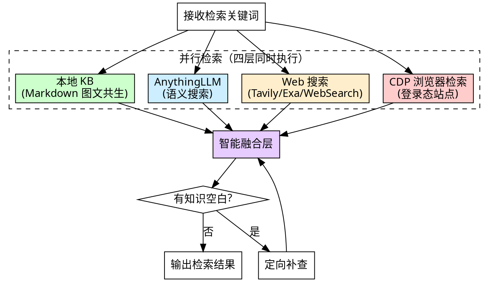

# 知识检索：多源检索与智能融合

从多个知识来源并行检索相关内容，智能评分、去重、融合，为方案撰写提供高质量素材。

**核心原则：** 宁多勿漏——检索阶段优先保证覆盖面，在融合阶段再精选。

## 四层检索架构



## 第一层：本地 KB（Markdown 图文共生）

1. 加载 `Local-KnowledgeBase/.index/kb_catalog.yaml`
2. 根据章节关键词匹配文档（标题、headings、summary）
3. 选择 1-5 个最相关文档
4. 读取 Markdown 正文，提取相关段落和内嵌图片
5. 如果匹配 >= 2 个文档，本地层视为充足

**文本-图片共生原则：** 图片内嵌在 Markdown 中（``），AI 自然读取上下文中的图片，无需单独匹配。

## 第二层：AnythingLLM（语义搜索）

### 可用性检测（F-014）

执行前先确认 AnythingLLM MCP 工具可用：

1. 读取配置 `anythingllm.enabled`（`python3 "${CLAUDE_PLUGIN_ROOT:-$SKILL_DIR/..}/skills/go/scripts/sm_config.py" get anythingllm.enabled`）
2. 检测 MCP 工具是否注册：
   - 尝试调用 `mcp__plugin_anythingllm-mcp_anythingllm__anythingllm_search`（query="probe"）
   - 工具不存在 / 调用失败 → `ANYTHINGLLM_AVAILABLE=false`

### 降级矩阵（mirror tender-workflow taw F-036）

`--kb-source` 与 `ANYTHINGLLM_AVAILABLE` 的交互行为：

| `--kb-source` | ANYTHINGLLM_AVAILABLE=false 时行为 |
|---|---|
| `anythingllm` | **致命错误** + 提示："/plugin install anythingllm-mcp@presales-skills 安装可选依赖；或改用 --kb-source local" |
| `auto` | **自动降级**：跳过第二层，仅走 第一层（本地 KB）+ 第三层（Web）+ 第四层（CDP，如启用）。其它层结果不变 |
| `local` | 正常走 local，与 AnythingLLM 状态无关 |
| `cdp` | 仅 CDP，与 AnythingLLM 状态无关 |
| `none` | 忽略 KB 检索，与 AnythingLLM 状态无关 |

### 检索流程（ANYTHINGLLM_AVAILABLE=true 时）

1. 检查 AnythingLLM 是否启用（配置 `anythingllm.enabled` 为 true）
2. 构造查询：`章节标题 + 关键词`
3. 调用 `anythingllm_search(query, workspace)`
4. 过滤：score >= 0.7，最多 5 条
5. 分类来源：固定素材 / 可复用素材 / 历史素材 / 参考素材

## 第三层：Web 搜索

1. 检测可用搜索工具：Tavily > Exa > WebSearch
2. 构造查询：`关键词 + 行业/领域 + 最新`
3. 执行搜索，提取相关内容摘要
4. 始终执行（不因本地 KB 充足而跳过）

## 第四层：CDP 浏览器检索（登录态站点）

通过 web-access plugin 的 CDP 浏览器自动化能力，检索需要登录才能访问的站点（如企业 Confluence、内部知识库、付费技术平台等）。复用用户日常 Chrome 的登录态，无需单独认证。

### 触发条件

读取配置 `cdp_sites.enabled`（通过 `python3 "${CLAUDE_PLUGIN_ROOT:-$SKILL_DIR/..}/skills/go/scripts/sm_config.py" get cdp_sites.enabled`）：
- `true` 且 `cdp_sites.sites` 非空 → 执行第四层
- `false` 或未配置 → 跳过第四层（退化为三层检索）

> **路径写法说明（F-022）**：`$SKILL_DIR/..` 在 plugin 模式注入；`$SKILL_DIR/..` 是 npx 模式 fallback。两种模式都解析到 `<solution-master>/skills/go/scripts/sm_config.py`。

### 执行流程

1. **读取站点配置：** `python3 "${CLAUDE_PLUGIN_ROOT:-$SKILL_DIR/..}/skills/go/scripts/sm_config.py" get cdp_sites`，获取站点列表
2. **启动 CDP Proxy**（前置依赖检查 — F-009）：
   ```bash
   command -v web-access-check
   ```
   - 命令存在（exit 0）→ 继续执行 `web-access-check` 完成环境自检 + 启动 CDP Proxy；未通过时引导用户完成 Chrome 远程调试设置（参照 web-access plugin 指引）
   - 命令不存在（exit 127）→ **跳过本第四层，直接进入第五层（智能融合）**；同时打印一行 stderr：`[knowledge-retrieval] web-access plugin 未安装，已跳过 CDP 登录态层（如需启用，运行 /plugin install web-access@presales-skills 后重试）`
3. **对每个站点执行检索（可通过子 Agent 并行）：**
   a. **加载站点经验：** 通过 `web-access-match-site '<domain>'` 读取该站点的经验内容——stdout 直接返回匹配的站点经验正文；stdout 为空表示没有对应经验文件，继续走通用检索流程
   b. **构造搜索 URL：** 将站点配置的 `search_url` 中的 `{query}` 替换为 URL 编码后的检索关键词（如"服务网格"编码为 `%E6%9C%8D%E5%8A%A1%E7%BD%91%E6%A0%BC`）
   c. **打开搜索页：** `curl -s "http://localhost:3456/new?url={搜索URL}"`
   d. **检测登录状态（结果驱动）：** 用 `/eval` 探测页面 DOM
      - 发现搜索结果内容 → 已登录，继续提取
      - 发现登录表单/重定向/空内容 → 未登录，提示用户：
        > "当前无法访问 {站点名} 的内容，请在你的 Chrome 中登录该站点{若有 login_url 则附加：（登录地址：{login_url}）}，完成后告诉我继续。"
      - 用户确认后 → `/navigate` 刷新页面，重试
   e. **自动探测并提取搜索结果：** 用 `/eval` 分析 DOM 结构，AI 自主识别搜索结果列表并提取：
      - 结果标题
      - 内容摘要/片段
      - 详情页链接
      - 限制提取数量：不超过站点配置的 `max_results`
   f. **深度提取（可选）：** 对高相关结果（AI 判断），`/new` 打开详情页提取完整正文
   g. **清理：** `/close` 关闭所有自建 tab

4. **格式化结果：** 每条结果标注来源为 `CDP — {站点名}`，附带原文链接
5. **汇入融合层：** 与其他三层结果一起进入智能融合

### 关键原则

- **遵循 web-access 的浏览哲学：** 不预设 DOM 结构，先观察再行动。AI 根据实际页面结构自主决定提取方式
- **结果驱动判断登录态：** 不检查 cookie 或 HTTP 状态码，只看目标内容是否拿到
- **最小侵入：** 所有操作在自建后台 tab 中进行，不触碰用户已有 tab
- **CDP Proxy 不需要重启：** 一次启动持续运行，跨检索任务复用

### 降级行为

- CDP Proxy 不可用（Chrome 未开启远程调试）→ 跳过第四层，不阻塞其他层
- 某站点登录失败/超时 → 该站点返回空结果，记录到知识空白，不阻塞其他站点
- web-access plugin 未安装 → 跳过第四层

## 智能融合层（核心改进）

### 评分维度

| 维度 | 权重 | 说明 |
|------|------|------|
| 相关性 | 40% | 内容与章节主题的语义匹配度 |
| 权威性 | 25% | 来源可信度（见下方优先级） |
| 完整性 | 20% | 内容的深度和详细程度 |
| 时效性 | 15% | 信息的新鲜程度 |

### 来源权威性优先级

根据内容类型自动调整来源优先级：

| 内容类型 | 优先来源 | 说明 |
|---------|---------|------|
| 企业自有产品/技术 | 本地 KB > CDP > AnythingLLM > Web | 企业内部文档最权威 |
| 行业标准/最佳实践 | Web > AnythingLLM > CDP > 本地 KB | 网络有最新标准 |
| 通用技术知识 | AnythingLLM > Web > CDP > 本地 KB | 语义搜索精度高 |
| 案例/经验 | 本地 KB > CDP > AnythingLLM > Web | 历史案例优先复用 |

### 融合流程

1. **收集** — 从四层检索收集所有结果
2. **评分** — 对每条结果按四维度评分
3. **去重** — 跨源语义去重（相似内容保留评分最高的版本）
4. **排序** — 按综合得分降序排列
5. **缺口分析** — 识别章节需要但无结果覆盖的知识点
6. **补查** — 对知识空白发起定向 Web 搜索（最多 2 次）

### 输出格式

```markdown
## 知识检索结果

### 高相关素材
1. **[标题/主题]**（来源：本地KB — 技术方案-XXX/full.md）
   [内容摘要]
   评分：相关性 9/10, 权威性 8/10, 完整性 7/10, 时效性 6/10

2. **[标题/主题]**（来源：CDP — {站点名}）
   [内容摘要]
   评分：相关性 8/10, 权威性 8/10, 完整性 7/10, 时效性 8/10

3. **[标题/主题]**（来源：AnythingLLM — workspace:xxx）
   [内容摘要]
   评分：...

### 补充素材
4. **[标题/主题]**（来源：Web — tavily_search）
   [内容摘要]

### 知识空白
- [未找到相关内容的知识点]（已尝试补查，无结果）
```

## 检索模式

### 撰写模式（默认）
- **输入：** 章节标题 + 关键词
- **输出：** 完整检索报告（含逐条评分、来源标注、知识空白）
- **用于：** solution-writing 撰写前检索

### 头脑风暴模式
- **输入：** 项目描述摘要 + 领域术语/概念列表
- **输出：** 领域知识内部摘要（200-500 字连贯文本，不含评分格式）
- **用于：** solution-brainstorming 的领域理解
- **差异：**
  - 查询构造：用「项目描述 + 领域术语」替代「章节标题 + 关键词」
  - 输出简化：去掉逐条评分格式，输出一段连贯的领域知识总结
  - 来源记录但不需要标注格式
  - 四层检索机制完全相同，仅输入构造和输出格式不同

## 配置参数

- `--kb-source`：`auto`（默认）/ `local` / `anythingllm` / `cdp` / `none`
  - `auto`：四层并行（第四层 CDP 需配置 `cdp_sites.enabled`），本地层 >= 2 结果时跳过 AnythingLLM
  - `local`：仅本地 KB + Web
  - `anythingllm`：仅 AnythingLLM + Web
  - `cdp`：仅 CDP 登录态站点 + Web
  - `none`：仅 Web
- `--search-tool`：`auto`（默认）/ `tavily` / `exa` / `websearch`

## 红线

- 不检索就撰写
- 忽略本地 KB 中的相关内容
- 检索报告中不标注来源（注意：来源标注仅在检索报告中保留，方案正文中不出现来源标注）
- 检索结果未经融合评分就直接使用
- CDP 站点已配置且可用时跳过第四层检索（降级场景除外）
