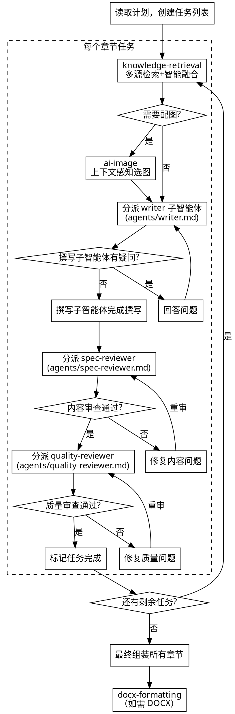
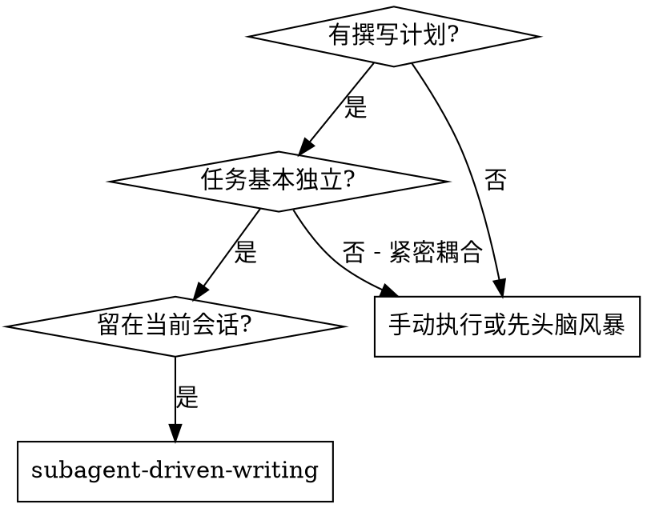
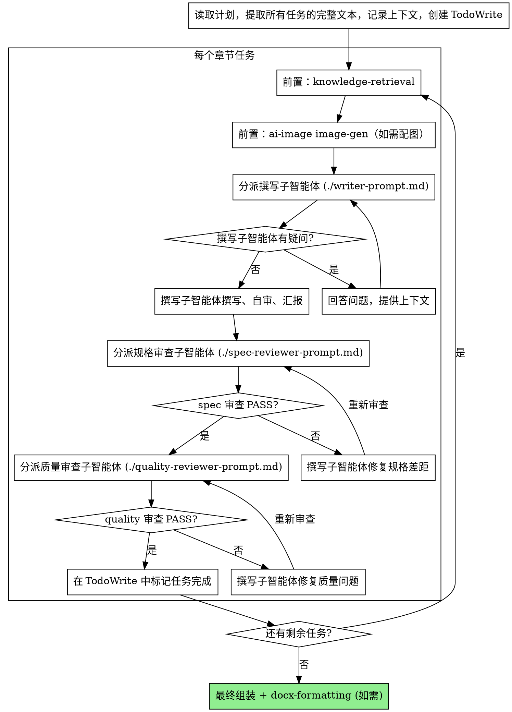

# 方案撰写：执行章节任务

通过为每个章节任务分派一个全新的子智能体来执行撰写计划，每个任务完成后进行两阶段审查：先审查内容正确性，再审查写作质量。

**为什么用子智能体：** 将任务委派给具有隔离上下文的专用子智能体。它们不继承你的会话历史——你精确构造它们所需的一切。这避免了上下文污染，也为你保留协调工作的上下文。

**核心原则：** 每个任务一个全新子智能体 + 两阶段审查（先规格后质量）= 高质量方案产出

## 流程图



## 执行步骤

### Phase 0：输入校验

1. 读取撰写计划文件（`docs/specs/*-plan.md`）
2. 提取所有任务的完整文本
3. 创建任务跟踪列表（使用 TaskCreate）
4. 确认用户选择的输出格式（Markdown / DOCX）
5. **draw.io 可用性前置检查**：
   - drawio 技能已作为 solution-master 插件的一部分捆绑分发，**默认情况下始终可用**（plugin 模式经由插件 skill 自动发现，npx 模式经由 `.claude/skills/draw/` 复制）
   - 如果用户明确自定义了 drawio 覆盖（例如 `/solution-config` 安装了本地版本），检测顺序为：
     ```python
     python3 -c "
     from pathlib import Path
     # drawio 已捆绑在 solution-master 插件中，默认可用
     # 此处仅检测用户是否提供了本地覆盖版本
     overrides = [
         Path('.claude/skills/draw/SKILL.md'),          # npx 项目模式覆盖
         Path.home() / '.claude/skills/draw/SKILL.md',  # 全局覆盖
     ]
     for p in overrides:
         if p.exists():
             print(f'INSTALLED: override at {p}')
             exit()
     print('INSTALLED: bundled with solution-master')
     "
     ```
   - 因为 drawio 必定可用，Phase 0 不会再触发"未安装"警告。若未来 solution-master 的分发形态改变、drawio 变成可选依赖，再补充降级警告逻辑

### Phase 1：知识检索 + 配图规划（每个任务）

<HARD-GATE>
**Phase 1 的 `Skill(skill="ai-image:gen")` 调用、knowledge-retrieval 的 MCP / Web 检索全部必须主 session 完成**——不能放进 writer subagent 的 prompt 让它自己调（subagent pre-approval 限制，参见 SKILL.md §子智能体工具限制）。

正确流程：
1. 主 session 跑 `Skill(skill="ai-image:gen")` 拿图片产出
2. 主 session 跑 knowledge-retrieval（详见该 workflow 自身的 hard-gate）
3. 把图片路径 + 检索结果拼进 writer subagent Task prompt 的"## 配图方案"和"## 知识库素材"段
4. writer subagent 在写章节时引用图片、用素材，**不调 Skill / MCP / Web***

反模式：派 writer 时让它"顺便调一下 Skill / 顺便去 Tavily 查一下" → subagent 端 §工具限制 自检会 NEEDS_CONTEXT 报回，浪费一轮。
</HARD-GATE>

1. 调用 knowledge-retrieval 技能，传入任务的 KB 检索关键词
2. **检查任务的"配图需求"字段**：
   - 如果配图需求明确表示需要图片（即字段值不是"无"、"无需配图"、"无配图需求"、"N/A"等否定性表述），**必须**通过 `Skill(skill="ai-image:gen")` 调用 ai-image plugin
   - ai-image plugin 产出一个"配图方案"（每张图的描述 + 图片路径或占位符）
   - 如果 ai-image plugin 调用失败（如 API 不可用），配图方案中使用标准占位符格式，不阻塞撰写流程
   - 如果配图需求明确为"无"或等价否定表述，跳过此步骤
3. 收集检索结果和配图方案（如有）

<HARD-GATE>
如果任务的"配图需求"字段表示需要图片（非"无"、"无需配图"、"无配图需求"、"N/A"），且未通过 `Skill(skill="ai-image:gen")` 调用 ai-image plugin，则不得进入 Phase 2（分派撰写子智能体）。
</HARD-GATE>

**配图方案产出格式**（传给 writer 子智能体）：
```
配图方案：
- H3 "xxx"：需要架构图 →  或 [图片占位符 — xxx架构设计：请手动插入图片]
- H3 "yyy"：需要流程图 → [图片占位符 — yyy业务流程：请手动插入图片]
- H3 "zzz"：无需配图
```

**图片路径规范：** 草稿文件保存在 `drafts/` 目录，图片保存在 `output/images/` 目录。因此配图方案中的图片路径必须使用 `../output/images/xxx.png` 格式（相对于 `drafts/` 目录）。**禁止**使用 `output/images/xxx.png`（这是相对于项目根目录的路径，从 `drafts/` 下的文件无法正确引用）。

writer 子智能体必须将上述每个图片引用/占位符插入到对应段落后，不可省略。

### Phase 2：分派撰写子智能体

构造子智能体提示，包含：
- 任务完整文本（直接粘贴，不是文件引用）
- 方案上下文（这个任务在整体方案中的位置）
- 知识库检索结果（Phase 1 产出）
- 配图方案（Phase 1 产出）
- 输出格式要求

子智能体返回状态：
- **DONE** → 进入审查
- **DONE_WITH_CONCERNS** → 读取疑虑后进入审查
- **NEEDS_CONTEXT** → 补充信息后重新分派
- **BLOCKED** → 上报用户

### Phase 3：两阶段审查

**审查反馈展示原则：每次审查完成后，必须将审查报告的关键内容展示给用户。**

**第一阶段：内容正确性审查（spec-reviewing）**
- 分派独立 spec-reviewer 子智能体
- 传入：计划中的任务要求 + 实际撰写产出
- 审查完成后 → **向用户展示审查结果**（PASS/FAIL + 问题列表）
- 结果 PASS → 进入第二阶段
- 结果 FAIL → 向用户展示问题和修复建议 → 撰写子智能体修复 → 重新审查

**第二阶段：写作质量审查（quality-reviewing）**
- 分派独立 quality-reviewer 子智能体
- 传入：实际撰写产出
- 审查完成后 → **向用户展示审查结果**（评分 + 关键发现）
- 结果 PASS → 任务完成
- 结果 FAIL → 向用户展示问题和修复建议 → 撰写子智能体修复 → 重新审查

**展示格式**：
```
📋 内容审查：✅ PASS（或 ❌ FAIL）
  - [通过项摘要]
  - [问题项及修复建议（如有）]

📋 质量审查：✅ PASS（评分 A/B）（或 ❌ FAIL 评分 C/D）
  - [优点]
  - [问题项及修复建议（如有）]
```

### Phase 4：最终组装

所有任务完成后：
1. 按章节顺序组装所有草稿，Markdown 完整方案保存到 `output/` 目录（如 `output/方案名称.md`）
2. **重写图片路径**：草稿中的 `../output/images/xxx` 在组装后需改为 `output/images/xxx`（项目根目录相对路径）。用全局替换 `](../output/images/` → `](output/images/` 即可。**说明**：虽然组装文件在 `output/` 下，但主流 IDE（VS Code 等）以项目根目录为基准解析 Markdown 图片路径，因此使用项目根相对路径确保预览正确
3. 检查章节间衔接
4. 生成目录
5. 如需 DOCX 输出，调用 docx-formatting 技能。DOCX 文件同样保存到 `output/` 目录

## 子智能体提示模板

分派撰写子智能体时使用以下结构（详见 `subagent-driven-writing/writer-prompt.md`）：

```
你是一个方案撰写子智能体。请参考 agents/writer.md 中的角色定义。

## 你的任务

[粘贴任务完整文本]

## 方案上下文

[方案名称、整体结构、当前章节在整体中的位置]

## 知识库素材

[knowledge-retrieval 的检索结果完整粘贴]

## 配图方案

[ai-image (image-gen) 的配图方案，如本任务无配图需求则写"本任务无配图需求"]

## 输出要求

- 格式：Markdown
- 保存到：drafts/[章节编号]_[章节名称].md
- 图片路径：使用 ../output/images/xxx.png 格式（相对于 drafts/ 目录），禁止使用 output/images/xxx.png
- 来源标注：正文中禁止出现任何来源标注（如"（出处：Web — xxx）"、"（来源：xxx）"等括号标注）。知识库素材的内容可以使用，但不要在正文中暴露检索来源
- 完成后以 subagent-driven-writing 的状态汇报规范汇报（DONE / DONE_WITH_CONCERNS / NEEDS_CONTEXT / BLOCKED）
```

## 章节模板

根据方案类型（technical / business / consulting / proposal），从 `$SKILL_DIR/prompts/section_templates/` 加载对应模板。典型用法：

```bash
cat "$SKILL_DIR/prompts/section_templates/technical.yaml"
```

`$SKILL_DIR` 由主 SKILL.md 顶部的 §路径自定位 bootstrap 解析（installed_plugins.json 五段式 fallback），指向 `<plugin-install-path>/skills/go/`。不要使用 `prompts/section_templates/...` 这样的 cwd-相对路径——Claude 的 cwd 是用户项目，不是 skill 所在目录。

## 红线

- 跳过知识检索直接撰写
- 跳过配图规划直接撰写（计划中有配图需求的任务）
- 跳过 spec-reviewing 直接进入 quality-reviewing
- 让撰写子智能体自己审查自己
- 审查不通过就跳到下一个任务
- 使用文件引用而非直接粘贴任务内容给子智能体


---

## 子智能体调度（来自 subagent-driven-writing）


<!--
Adapted from superpowers-zh/skills/subagent-driven-development/SKILL.md (MIT, jnMetaCode)
Source commit: 4a55cbf9f348ba694cf5cbf4d56df7340ff2b74f

Changes from upstream:
  - Domain changed from code development to document writing
  - Role names: implementer -> writer, code-reviewer -> quality-reviewer
  - Review criteria adjusted to Solution Master's spec-reviewing + quality-reviewing
  - All red-line segments, non-trust principles, and status labels preserved verbatim
-->

# 子智能体驱动撰写

通过为每个章节任务分派一个全新的子智能体来执行撰写计划，每个任务完成后进行两阶段审查：先审查内容正确性（spec-reviewing），再审查写作质量（quality-reviewing）。

**为什么用子智能体：** 你将任务委派给具有隔离上下文的专用智能体。通过精心设计它们的指令和上下文，确保它们专注并成功完成任务。它们不应继承你的会话上下文或历史记录——你要精确构造它们所需的一切。这样也能为你自己保留用于协调工作的上下文。

**核心原则：** 每个任务一个全新子智能体 + 两阶段审查（先内容正确性后写作质量）= 高质量、可追溯的方案产出

## 何时使用



**核心特点：**
- 同一会话（无上下文切换）
- 每个章节全新子智能体（无上下文污染）
- 每个章节后两阶段审查：先内容正确性（spec-reviewing），再写作质量（quality-reviewing）
- 审查者必须亲自 Read 实际 draft 文件逐条核对，不信任撰写者的自述

## 流程



## 模型选择

使用能胜任每个角色的最低成本模型，以节省开支并提高速度。

**机械性撰写任务**（独立小节、清晰的要点、模板化内容）：使用快速、便宜的模型。

**集成和判断类任务**（多节协调、论证推演、术语一致性）：使用标准模型。

**架构、结构和审查类任务**（整体审阅、终稿把关）：使用最强的可用模型。

## 处理撰写者状态

撰写子智能体报告四种状态之一。根据每种状态进行相应处理：

**DONE：** 进入规格合规性审查。

**DONE_WITH_CONCERNS：** 撰写者完成了工作但标记了疑虑。在继续之前阅读这些疑虑。如果疑虑涉及正确性或范围，在审查前解决。如果只是观察性说明（如"这个章节篇幅偏长"），记录下来并继续审查。

**NEEDS_CONTEXT：** 撰写者需要未提供的信息。提供缺失的上下文并重新分派。

**BLOCKED：** 撰写者无法完成任务。评估阻塞原因：
1. 如果是上下文问题，提供更多上下文并用同一模型重新分派
2. 如果任务需要更强的推理能力，用更强的模型重新分派
3. 如果任务太大，拆分为更小的部分
4. 如果计划本身有问题，上报给人类

**绝不** 忽略上报或在不做任何更改的情况下让同一模型重试。如果撰写者说卡住了，说明有什么东西需要改变。

## 提示词模板

- `./writer-prompt.md` - 分派撰写子智能体
- `./spec-reviewer-prompt.md` - 分派规格合规审查子智能体
- `./quality-reviewer-prompt.md` - 分派写作质量审查子智能体

## 红线

**绝不：**
- 跳过 knowledge-retrieval（或在配图需求非空时跳过 `Skill(skill="ai-image:gen")` 调用）直接撰写
- 跳过审查（spec-reviewing 或 quality-reviewing）
- 带着未修复的问题继续
- 并行分派多个撰写子智能体写同一章节（会冲突）
- 让子智能体读取计划文件（应提供完整文本）
- 跳过场景铺设上下文（子智能体需要理解章节在整体方案中的位置）
- 忽视子智能体的问题（在让它们继续之前先回答）
- 在内容正确性上接受"差不多就行"（spec-reviewer 发现问题 = 未完成）
- 跳过审查循环（审查者发现问题 = 撰写者修复 = 再次审查）
- 让撰写者的自审替代正式审查（两者都需要）
- **在 spec-reviewing 通过之前开始 quality-reviewing**（顺序错误）
- 在任一审查有未解决问题时就进入下一个任务
- **让审查者只读撰写者的报告而不读实际产出**（审查者必须亲自用 Read 工具打开 draft 文件逐条核对——这是防伪审的核心）

**如果子智能体提问：**
- 清晰完整地回答
- 必要时提供额外上下文
- 不要催促它们进入撰写阶段

**如果审查者发现问题：**
- 撰写者（同一子智能体）修复
- 审查者再次审查
- 重复直到通过
- 不要跳过重新审查

**如果子智能体失败：**
- 分派修复子智能体并提供具体指令
- 不要尝试手动修复（上下文污染）

## 集成

**必需的前置 workflow（v1.0.0 后单 SKILL `go` + workflow/ 子文件结构）：**
- **`workflow/brainstorming.md`** - 需求提取
- **`workflow/planning.md`** - 任务分解与验收标准
- **`workflow/knowledge-retrieval.md`** - 每个任务撰写前的素材检索
- **ai-image plugin** - 每个任务撰写前的配图规划（独立 plugin，通过 `Skill(skill="ai-image:gen")` 或自然语言触发）

**配套 workflow：**
- **本文件 `workflow/writing.md`** - 领域特有执行流程（draw.io 检查、Phase 1/2/3、最终组装）+ 子智能体驱动骨架

**产出下游：**
- **docx-formatting** - 所有章节完成后的 DOCX 输出
