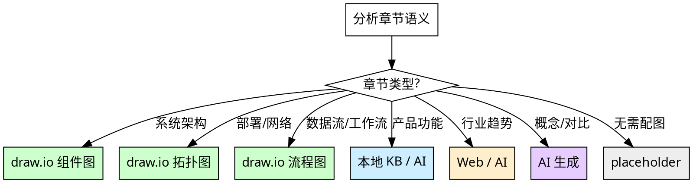

# 配图生成：上下文感知的智能选图

根据章节内容的语义特征，自动选择最合适的图片来源和生成方式。

**核心原则：** 配图服务于内容理解，不是装饰。每张图都应传递文字难以表达的信息。

## 图片来源

| 来源 | 说明 | 适用场景 |
|------|------|---------|
| `local` | 本地 KB 内嵌图片 | 产品截图、已有架构图 |
| `drawio` | draw.io 生成图表 | 架构图、流程图、拓扑图 |
| `ai` | AI 生成（火山/阿里/Gemini） | 概念图、示意图、对比图 |
| `web` | 网络下载图片 | 行业数据图、公开资料 |
| `placeholder` | 文本占位符 | 无合适图源时的兜底 |
| `auto` | 上下文自动选择（默认） | 由启发式规则决定 |

## 上下文启发式规则

### 详细映射规则

| 章节语义关键词 | 推荐图源（优先级） | 图表类型 |
|--------------|-------------------|---------|
| 架构设计、总体架构、技术架构 | draw.io > AI > placeholder | 分层组件图 |
| 部署方案、部署拓扑、网络架构 | draw.io > AI > placeholder | 拓扑图 |
| 数据流、业务流程、工作流程 | draw.io > AI > placeholder | 流程图 |
| 监控方案、运维架构 | draw.io > AI > placeholder | 架构图 |
| 安全架构、安全框架 | draw.io > AI > placeholder | 分层架构图 |
| 产品功能、系统界面、操作演示 | local > AI > web > placeholder | 截图/示意图 |
| 组织架构、团队结构 | draw.io > AI > placeholder | 组织图 |
| 行业趋势、市场分析、对比分析 | web > AI > placeholder | 数据图/对比图 |
| 项目计划、里程碑、甘特图 | draw.io > placeholder | 时间线图 |

## 流程

1. **分析章节语义** — 从章节标题和要点清单提取语义特征
2. **匹配启发式规则** — 按上表确定推荐图源和图表类型
3. **检查图源可用性** — draw.io CLI 是否可用？AI API Key 是否配置？
   - draw.io skill：已随 solution-master 插件捆绑分发，默认可用，无需单独检测
   - draw.io CLI 检查：读取配置 `drawio.cli_path`
4. **降级通知与处理（如需）** — 当图源工具不可用时，**必须向用户发出警告**：
   - **draw.io CLI 未配置**（不降级）：`⚠️ draw.io CLI 未配置，"{章节标题}"的{图表类型}将生成 .drawio 文件但无法自动导出为 PNG。建议运行 /solution-config setup 配置 CLI 路径。` → 仍使用 draw.io skill 生成 .drawio 文件，跳过 PNG 导出
   - **AI API Key 未配置**（触发降级）：`⚠️ AI 图片生成不可用（API Key 未配置），"{章节标题}"的{图表类型}将使用 placeholder。建议运行 /solution-config setup 配置 API Key。` → 按推荐图源列表降级到下一可用图源
   - 此警告不可省略、不可静默跳过
5. **生成/检索图片** — 使用确定的图源调用对应工具
6. **验证图片质量** — 文件大小 > 5KB，尺寸合理

## 工具调用

### draw.io
- CLI 路径：配置 `drawio.cli_path`
- 输出：PNG（标准格式，可直接嵌入 DOCX）

### AI 生成
- 工具：`${CLAUDE_SKILL_DIR}/scripts/ai_image_generator.py`
- 供应商：配置 `ai_image.default_provider`
- 传入：diagram_type + topic + details

### 本地 KB
- 从 knowledge-retrieval 结果中提取内嵌图片
- 图片路径：`Local-KnowledgeBase/<目录>/images/<HASH>.jpg`

### Web 图片
- 通过 Web 搜索获取公开可用的图片
- 需验证图片许可（避免版权问题）

## 护栏（参见 `${CLAUDE_SKILL_DIR}/../solution-writing/prompts/image_guidelines.yaml`）

- 每章最多 8 张图
- 每个 H3 小节最多 1 张图
- 章节内和跨章节去重
- 图片描述格式：`图 {章节号}-{序号}：{上下文相关描述}`

## 红线

- 强制每个章节都配图（不需要就不配）
- 使用模糊的通用图片描述
- 忽略图片护栏规则
- 不验证图片质量就使用
