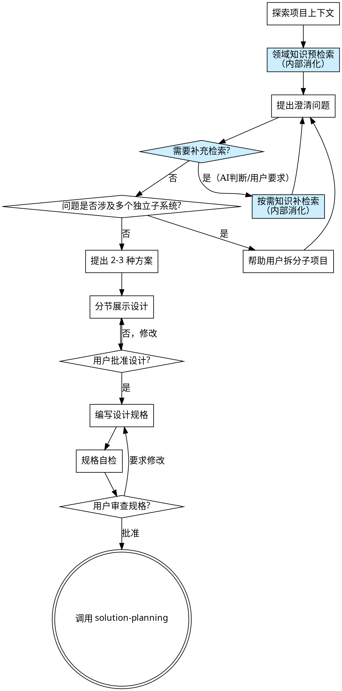

# 头脑风暴：将项目需求转化为方案设计

通过苏格拉底式对话，帮助将模糊的项目需求转化为完整的方案设计规格说明。

首先了解项目上下文，然后逐一提问来完善需求理解。一旦你理解了要解决的问题和方案方向，就展示设计方案并获得用户批准。

<HARD-GATE>
在你展示设计方案并获得用户批准之前，不要调用任何撰写技能（solution-planning、solution-writing）或采取任何撰写行动。这适用于所有方案，无论看起来多简单。
</HARD-GATE>

## 反模式："需求已经很清楚了，不需要头脑风暴"

每个方案都要经过这个流程。一个"简单的"技术方案、一个"明确的"业务需求——全都需要。"清楚"的需求恰恰是未经检验的假设造成最多返工的地方。头脑风暴可以很简短（对于真正简单的需求几个问题就够了），但你必须走完流程并获得批准。

## 检查清单

你必须按顺序完成以下步骤：

1. **探索项目上下文** — 检查已有文件、文档、相关资料
2. **领域知识预检索** — 提取项目领域关键词，调用 knowledge-retrieval（头脑风暴模式），内部消化领域知识
3. **提出澄清问题** — 每次一个，了解项目背景、需求、约束。过程中按需补充检索
4. **提出 2-3 种方案** — 附带权衡分析和你的推荐
5. **展示设计** — 按复杂度分节展示，每节展示后获得用户批准
6. **编写设计规格** — 保存到 `docs/specs/YYYY-MM-DD-<主题>-design.md`
7. **规格自检** — 检查占位符、矛盾、模糊性、范围
8. **用户审查规格** — 请用户审查规格文件
9. **过渡到计划** — 调用 solution-planning 技能

## 流程图



**终止状态是调用 solution-planning。** 不要调用 solution-writing 或任何其他撰写技能。

## 苏格拉底式提问详述

### 理解需求

- 首先查看已有项目资料（如有）
- 评估范围：如果需求涉及多个独立子系统，立即指出并帮助拆分
- 对于范围适当的需求，每次提一个问题来完善理解
- **优先使用选择题**，开放式问题也可以
- **每条消息只提一个问题**——需要更多探索时拆分成多个问题

### 问题维度

根据方案类型，从以下维度提问：

**通用维度（所有方案）：**
- 项目背景：谁是客户？什么行业？什么规模？
- 核心需求：要解决什么问题？期望达到什么效果？
- 约束条件：时间、预算、技术栈、合规要求？
- 成功标准：如何衡量方案的成功？

**技术方案附加维度：**
- 现有系统：当前架构是什么？有哪些技术债务？
- 技术选型：有无偏好的技术栈？需要与哪些系统集成？
- 性能要求：并发量、响应时间、数据量？
- 安全合规：等保要求、数据安全等级？

**业务方案附加维度：**
- 商业模式：盈利模式是什么？目标客户群？
- 竞争态势：主要竞争对手？差异化优势？
- 实施路径：分几个阶段？关键里程碑？
- 风险因素：主要风险是什么？如何应对？

**咨询报告附加维度：**
- 调研范围：需要覆盖哪些方面？
- 数据来源：现有数据有哪些？需要额外调研吗？
- 决策目标：报告要支持什么决策？
- 受众：谁是主要读者？专业程度如何？

### 提出方案

当你充分理解需求后：
- 提出 2-3 种方案，每种包含：核心思路、优势、劣势、适用条件
- 给出你的推荐及理由
- 用表格或对比列表展示差异

### 展示设计

- 按章节/模块分节展示
- 每节展示后请用户确认
- 复杂方案可以先展示总体框架，再逐节细化

## 知识检索集成

头脑风暴过程中，通过 knowledge-retrieval 技能（头脑风暴模式）获取领域知识，以提出更专业、更有针对性的问题。

### 核心原则

- **检索结果仅供内部消化** — 不以任何形式向用户透露检索行为或检索内容。禁止的形式包括但不限于：检索报告、评分、来源列表、「检索知识补充：...」注释、「根据检索了解到...」说明、括号内的知识补充。检索知识只能体现在更好的提问质量中——你问出更专业的问题，而不是告诉用户你查到了什么
- **不改变对话节奏** — 检索在后台完成，用户感知到的仍然是一问一答的对话流

### 预检索（步骤 2）

在用户描述项目需求后、开始苏格拉底式提问前：

1. 从用户描述和项目上下文中提取：
   - 行业/领域（如：智慧城市、金融科技、制造业）
   - 关键技术或业务术语（如：数字孪生、微服务、供应链金融）
   - 项目类型（如：技术方案、咨询报告、业务规划）
2. 如果用户初始描述无法提取出至少 2 个领域关键词（如只说了「写一个技术方案」而未说明行业、技术或业务方向），先问 1-2 个范围界定问题，再做预检索
3. 调用 knowledge-retrieval（头脑风暴模式），传入上述关键词
4. 内部消化检索结果，形成领域知识基础
5. 基于领域知识开始提问

### 按需补检索（步骤 3 中）

在苏格拉底式提问过程中，以下情况触发补充检索：

**AI 自行判断触发：**
- 用户提到的具体技术/标准/产品/法规是你不熟悉的
- 用户的回答揭示了一个新的子领域（预检索未覆盖）
- 你需要了解特定行业的最佳实践才能提出有价值的问题

**用户显式触发：**
- 用户说「去查一下 XXX」「你了解 XXX 吗」「搜索一下 XXX」等

**补检索流程：**
1. 识别需要检索的具体术语/概念
2. 调用 knowledge-retrieval（头脑风暴模式）
3. 内部消化结果
4. 继续提问：
   - **AI 自行触发时：** 不要告诉用户「我刚查了一下」，直接用获取的知识提出更好的问题
   - **用户显式触发时：** 简短确认（如「我了解了一下 XXX 的情况」），然后基于检索知识继续提问

**节奏控制（仅约束 AI 自行触发，用户显式触发不受此限制）：**
- 不设固定次数上限
- AI 自行触发时，两次补检索之间至少间隔 1-2 轮正常提问，避免连续检索拖慢对话
- 用户连续要求检索时，立即响应，不延迟
- 如果新概念与已检索领域高度相关，优先利用已有知识而非重新检索
- 每次用精确术语/概念作为关键词，避免宽泛查询

## 设计规格文档格式

保存到 `docs/specs/YYYY-MM-DD-<主题>-design.md`：

```markdown
# <方案名称> 设计规格

## 项目背景
[项目背景、客户信息、行业]

## 核心需求
[需求清单，按优先级排列]

## 约束条件
[时间、预算、技术、合规等约束]

## 方案概述
[选定方案的总体描述]

## 章节规划
[方案文档的章节结构大纲]

## 成功标准
[可量化的成功指标]

## 风险与应对
[主要风险及应对措施]
```

## 规格自检

编写完规格后快速检查：
- 有无占位符（TODO、待确认、TBD）？
- 有无前后矛盾的描述？
- 有无模糊不清的要求？
- 范围是否合理（不过大也不过小）？
- 所有用户确认的内容是否都已记录？

## 红线

- 未经用户批准就开始撰写
- 跳过问题直接给方案
- 一次提多个问题
- 假设用户意图而不确认
- 以任何形式向用户透露检索结果——包括「检索知识补充：...」注释、括号内知识说明、「我了解到...」「根据检索...」等变体（唯一例外：用户显式触发检索后的简短确认）
