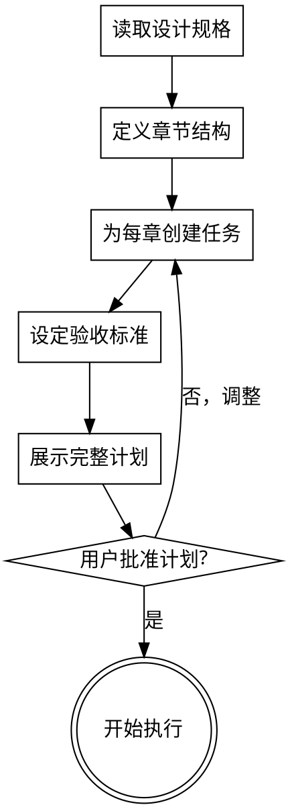

# 方案规划：将设计转化为撰写任务

将方案设计规格分解为小颗粒的撰写任务，每个任务有明确的验收标准。

**核心原则：** 每个任务 = 一个章节或子章节 = 一个独立子智能体可完成的工作单元。

## 前置条件

- 方案设计规格已完成（solution-brainstorming 产出）
- 用户已审查并批准设计规格

## 流程图



## 任务定义格式

每个任务必须包含以下信息：

```markdown
### 任务 N：[章节编号] [章节标题]

**层级：** H2 / H3 / H4
**目标字数：** XXXX 字
**依赖：** [前置任务编号，如有]

**要点清单：**
1. [必须覆盖的要点 1]
2. [必须覆盖的要点 2]
3. [必须覆盖的要点 3]

**KB 检索关键词：**
- [关键词 1]
- [关键词 2]

**配图需求：**
- [需要的图片类型和描述]
- 建议图源：[local / drawio / ai / web / placeholder]

**验收标准：**
- [ ] 覆盖所有要点
- [ ] 字数达到目标（±10%）
- [ ] 知识库素材已使用并标注来源
- [ ] 配图已插入
- [ ] 通过 spec-reviewing
- [ ] 通过 quality-reviewing
```

## 计划编写规则

### 章节结构优先

先定义完整的章节结构（目录树），再逐章创建任务：

```markdown
## 章节结构

1. 项目概述
   1.1 项目背景
   1.2 需求分析
2. 总体方案设计
   2.1 设计原则
   2.2 架构设计
   ...
```

### 任务粒度

- 每个任务对应一个 H2 或 H3 级章节
- 如果一个章节超过 3000 字，拆分为子任务
- 如果一个章节少于 500 字，考虑合并到相邻章节

### 禁止占位符

以下表述在任务中**禁止**出现：
- "待确定"、"TBD"、"TODO"
- "参照任务 N"（每个任务必须自包含）
- "添加适当的内容"
- "根据实际情况调整"

每个要点必须具体到可执行。

### 任务间依赖

- 标记任务间的依赖关系
- 无依赖的任务可以并行执行
- 有依赖的任务按顺序执行

## 计划输出

计划保存到 `docs/specs/YYYY-MM-DD-<主题>-plan.md`：

```markdown
# <方案名称> 撰写计划

**设计规格：** [设计规格文件路径]
**任务总数：** N
**预计总字数：** XXXXX 字

## 章节结构

[完整的目录树]

## 任务列表

### 任务 1：...
### 任务 2：...
...

## 执行策略

- 子智能体隔离：每个任务分派独立子智能体
- 审查流程：每个任务完成后先 spec-reviewing 再 quality-reviewing
- 可并行任务：[列出可并行的任务组]
```

## 过渡到执行

计划获批后，按以下方式执行：

1. 按任务顺序（考虑依赖关系）逐个执行
2. 每个任务：knowledge-retrieval → ai-image (image-gen) → solution-writing → spec-reviewing → quality-reviewing
3. 所有任务完成后最终组装

## 红线

- 任务描述中有占位符
- 验收标准不可验证
- 跳过用户审批直接执行
- 任务粒度过大（单个任务超过 3000 字）
