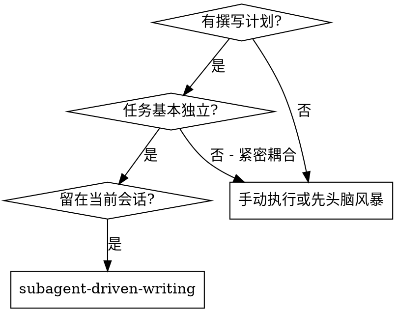
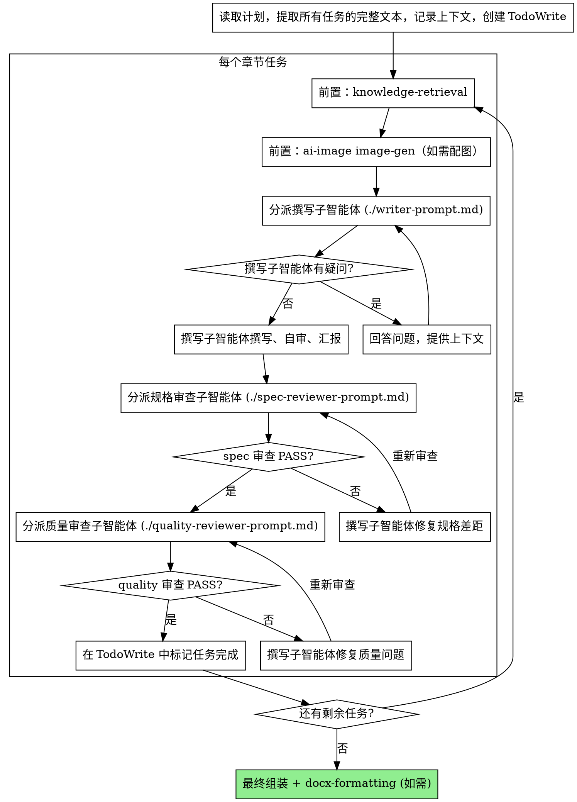

<!--
Adapted from superpowers-zh/skills/subagent-driven-development/SKILL.md (MIT, jnMetaCode)
Source commit: 4a55cbf9f348ba694cf5cbf4d56df7340ff2b74f

Changes from upstream:
  - Domain changed from code development to document writing
  - Role names: implementer -> writer, code-reviewer -> quality-reviewer
  - Review criteria adjusted to Solution Master's spec-reviewing + quality-reviewing
  - All red-line segments, non-trust principles, and status labels preserved verbatim
-->

# 子智能体驱动撰写

通过为每个章节任务分派一个全新的子智能体来执行撰写计划，每个任务完成后进行两阶段审查：先审查内容正确性（spec-reviewing），再审查写作质量（quality-reviewing）。

**为什么用子智能体：** 你将任务委派给具有隔离上下文的专用智能体。通过精心设计它们的指令和上下文，确保它们专注并成功完成任务。它们不应继承你的会话上下文或历史记录——你要精确构造它们所需的一切。这样也能为你自己保留用于协调工作的上下文。

**核心原则：** 每个任务一个全新子智能体 + 两阶段审查（先内容正确性后写作质量）= 高质量、可追溯的方案产出

## 何时使用

**核心特点：**
- 同一会话（无上下文切换）
- 每个章节全新子智能体（无上下文污染）
- 每个章节后两阶段审查：先内容正确性（spec-reviewing），再写作质量（quality-reviewing）
- 审查者必须亲自 Read 实际 draft 文件逐条核对，不信任撰写者的自述

## 流程

## 模型选择

使用能胜任每个角色的最低成本模型，以节省开支并提高速度。

**机械性撰写任务**（独立小节、清晰的要点、模板化内容）：使用快速、便宜的模型。

**集成和判断类任务**（多节协调、论证推演、术语一致性）：使用标准模型。

**架构、结构和审查类任务**（整体审阅、终稿把关）：使用最强的可用模型。

## 处理撰写者状态

撰写子智能体报告四种状态之一。根据每种状态进行相应处理：

**DONE：** 进入规格合规性审查。

**DONE_WITH_CONCERNS：** 撰写者完成了工作但标记了疑虑。在继续之前阅读这些疑虑。如果疑虑涉及正确性或范围，在审查前解决。如果只是观察性说明（如"这个章节篇幅偏长"），记录下来并继续审查。

**NEEDS_CONTEXT：** 撰写者需要未提供的信息。提供缺失的上下文并重新分派。

**BLOCKED：** 撰写者无法完成任务。评估阻塞原因：
1. 如果是上下文问题，提供更多上下文并用同一模型重新分派
2. 如果任务需要更强的推理能力，用更强的模型重新分派
3. 如果任务太大，拆分为更小的部分
4. 如果计划本身有问题，上报给人类

**绝不** 忽略上报或在不做任何更改的情况下让同一模型重试。如果撰写者说卡住了，说明有什么东西需要改变。

## 提示词模板

- `./writer-prompt.md` - 分派撰写子智能体
- `./spec-reviewer-prompt.md` - 分派规格合规审查子智能体
- `./quality-reviewer-prompt.md` - 分派写作质量审查子智能体

## 红线

**绝不：**
- 跳过 knowledge-retrieval（或在配图需求非空时跳过 ai-image plugin 的 `image-gen` 命令）直接撰写
- 跳过审查（spec-reviewing 或 quality-reviewing）
- 带着未修复的问题继续
- 并行分派多个撰写子智能体写同一章节（会冲突）
- 让子智能体读取计划文件（应提供完整文本）
- 跳过场景铺设上下文（子智能体需要理解章节在整体方案中的位置）
- 忽视子智能体的问题（在让它们继续之前先回答）
- 在内容正确性上接受"差不多就行"（spec-reviewer 发现问题 = 未完成）
- 跳过审查循环（审查者发现问题 = 撰写者修复 = 再次审查）
- 让撰写者的自审替代正式审查（两者都需要）
- **在 spec-reviewing 通过之前开始 quality-reviewing**（顺序错误）
- 在任一审查有未解决问题时就进入下一个任务
- **让审查者只读撰写者的报告而不读实际产出**（审查者必须亲自用 Read 工具打开 draft 文件逐条核对——这是防伪审的核心）

**如果子智能体提问：**
- 清晰完整地回答
- 必要时提供额外上下文
- 不要催促它们进入撰写阶段

**如果审查者发现问题：**
- 撰写者（同一子智能体）修复
- 审查者再次审查
- 重复直到通过
- 不要跳过重新审查

**如果子智能体失败：**
- 分派修复子智能体并提供具体指令
- 不要尝试手动修复（上下文污染）

## 集成

**必需的前置技能：**
- **solution-brainstorming** - 需求提取
- **solution-planning** - 任务分解与验收标准
- **knowledge-retrieval** - 每个任务撰写前的素材检索
- **ai-image (image-gen)** - 每个任务撰写前的配图规划（独立 plugin，通过 bin 命令调用）

**并行使用：**
- **solution-writing** - 领域特有执行流程（draw.io 检查、Phase 1/2/3、最终组装），本技能提供其子智能体驱动骨架

**产出下游：**
- **docx-formatting** - 所有章节完成后的 DOCX 输出
