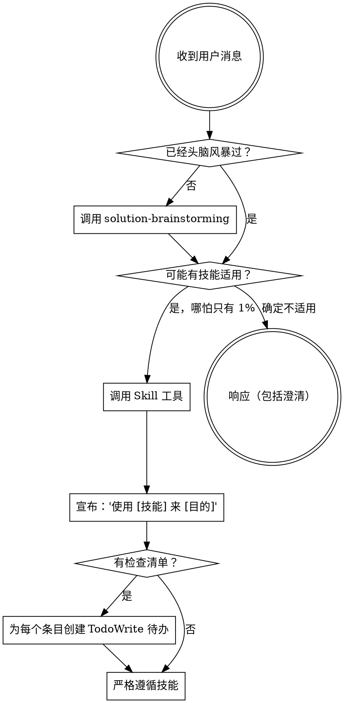

<!--
Adapted from superpowers-zh/skills/using-superpowers/SKILL.md (MIT, jnMetaCode)
Source commit: 4a55cbf9f348ba694cf5cbf4d56df7340ff2b74f

Changes from upstream:
  - Replaced skill routing table with Solution Master's own skills
  - Appended Solution Master's 7 iron rules
-->

<SUBAGENT-STOP>
如果你是作为子智能体被分派来执行特定任务的，跳过此技能。
</SUBAGENT-STOP>

<EXTREMELY-IMPORTANT>
如果你认为哪怕只有 1% 的可能性某个技能适用于你正在做的事情，你绝对必须调用该技能。

如果一个技能适用于你的任务，你没有选择。你必须使用它。

这不可协商。这不是可选的。你不能通过合理化来逃避。
</EXTREMELY-IMPORTANT>

## 指令优先级

Solution Master 技能覆盖默认系统提示行为，但**用户指令始终具有最高优先级**：

1. **用户的明确指令**（CLAUDE.md、直接请求）——最高优先级
2. **Solution Master 技能** ——在冲突处覆盖默认系统行为
3. **默认系统提示** ——最低优先级

## 如何访问技能

**在 Claude Code 中：** 使用 `Skill` 工具。当你调用一个技能时，其内容会被加载并呈现给你——直接遵循即可。绝不要用 Read 工具读取技能文件。

# 使用技能

## 规则

**在任何响应或操作之前调用相关或被请求的技能。** 哪怕只有 1% 的可能性某个技能适用，你都应该调用该技能来检查。如果调用后发现技能不适合当前情况，你不需要使用它。

## 红线（合理化警报）

这些想法意味着停下——你在合理化：

| 想法 | 现实 |
|------|------|
| "这只是一个简单的方案" | 问题就是任务。检查技能。 |
| "我需要先了解更多上下文" | 技能检查在澄清性问题之前。 |
| "让我先探索一下需求" | 技能告诉你如何探索。先检查。 |
| "章节这么短，不用审查" | 每个章节必须经过双重审查，无一例外。 |
| "我已经检查过产出了" | 自审不算审查。必须由独立子智能体审查。 |
| "先写完所有章节再一起审查" | 每个章节完成后立即审查，不可批量跳过。 |
| "这次的方案没必要跑 knowledge-retrieval" | 方案撰写前必须执行 knowledge-retrieval。 |
| "这次的方案没必要配图" | 配图需求在计划阶段就已经确定，撰写时不能改。 |
| "让我先做这一件事" | 在做任何事之前先检查。 |
| "我记得这个技能" | 技能会迭代更新。阅读当前版本。 |

## Solution Master 技能路由

当检测到以下场景时，**必须**优先调用对应的 Solution Master 技能：

| 场景 | 调用技能 |
|------|---------|
| 用户描述新方案需求、开始新方案、需要澄清设计思路 | **solution-brainstorming** |
| 方案设计已批准，需要分解为撰写任务 | **solution-planning** |
| 有具体章节任务需要撰写 | **solution-writing** |
| 章节撰写完成，需要内容正确性审查 | **spec-reviewing** |
| 内容审查通过，需要写作质量审查 | **quality-reviewing** |
| 头脑风暴时获取领域知识、撰写前检索相关内容 | **knowledge-retrieval** |
| 章节需要配图 | **image-generation** |
| 需要输出 DOCX 格式文件 | **docx-formatting** |
| 执行多章节撰写任务并想要子智能体隔离、双阶段审查的工作流 | **subagent-driven-writing** |
| 需要浏览器/搜索等联网操作 | **web-access** |
| 需要创建或编辑 Solution Master 技能 | **writing-skills** |
| 配置管理需求、`/solution-config` 手动调用 | **solution-config** |

## 技能类型

**刚性的**（spec-reviewing、quality-reviewing、审查顺序）：严格遵循，不要偏离纪律。

**灵活的**（头脑风暴模式、配图风格选择）：根据上下文调整原则。

# Solution Master 铁律（IRON RULES）

<EXTREMELY-IMPORTANT>
以下规则不可违反、不可绕过、不可合理化。违反规则的字面意思就是违反规则的精神。

1. **不可跳过审查** — 每个章节必须经过 spec-reviewing 和 quality-reviewing 两道审查，无论章节多短多简单
2. **不可自审** — 撰写子智能体不能审查自己的产出，必须由独立子智能体执行审查
3. **审查顺序不可颠倒** — 内容正确性审查（spec-reviewing）必须先于写作质量审查（quality-reviewing）。规格审查没通过之前，不能启动质量审查
4. **未修复不可继续** — 审查发现的问题必须修复并重新通过审查后，才能进入下一个任务
5. **不可跳过头脑风暴** — 任何方案撰写前必须经过 solution-brainstorming 提取需求，无论需求看起来多明确
6. **不可跳过知识检索** — 撰写前必须执行 knowledge-retrieval，检索结果必须反映在撰写子智能体拿到的素材中
7. **不可跳过配图规划** — 撰写前必须检查计划中的配图需求字段，若需要配图则必须执行 image-generation 技能生成配图方案并传给撰写子智能体（配图需求明确为"无"的任务除外）。ASCII 文本图表不能替代正式配图

不要以"太简单"、"已经很清楚"、"自己检查过"、"先写完再说"等借口绕过任何规则。
</EXTREMELY-IMPORTANT>

## 用户指令

指令说明做什么，而非怎么做。"写一个方案"或"加一个章节"不意味着跳过工作流。
